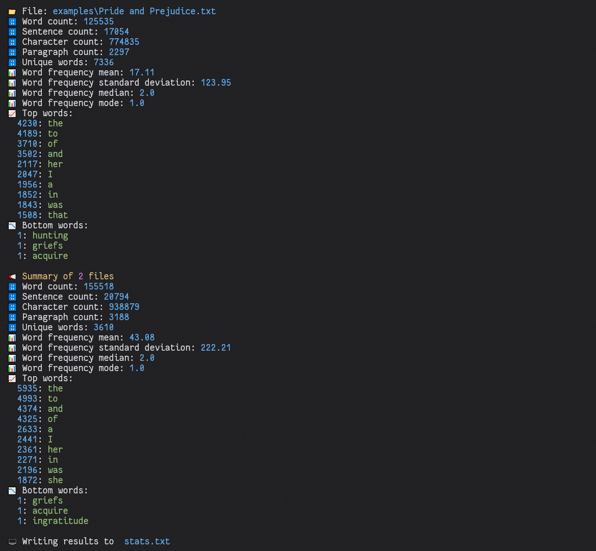
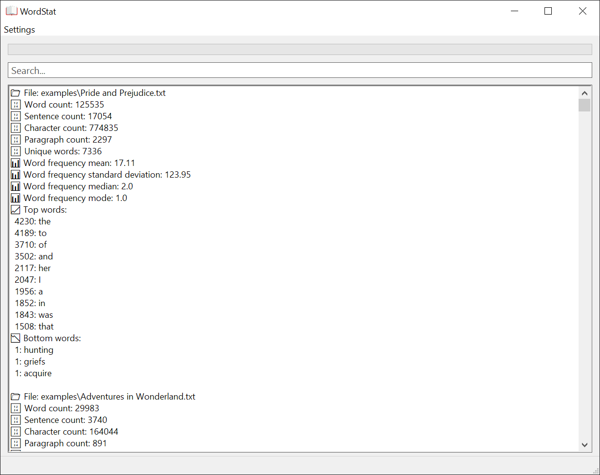

# wordstat

Simple tool to quickly count the frequency of words in a file or collection of files.

## Usage

### CLI



Running wordstat requires specifying the path to an input file or directory with files to process.

#### Example

```shell
wordstat --outfile stats.txt examples
```

#### Details

```shell
wordstat.exe [OPTIONS] [PATH]...

ARGS:
    <PATH>...    Path to one or multiple files or directories of files to analyze

OPTIONS:
    -b, --bottom-words <BOTTOM_WORDS>    Number of least occuring words to show per file [default: 3]
    -e, --emojis                         Show matching emojis for words
    -f, --follow-symlinks                Follow symlinks
    -h, --help                           Print help information
    -l, --lowercase                      Normalize casing by lowercasing each occuring word
    -o, --outfile <OUTFILE>              The path to a file that the results will be written to, will overwrite if it already exists
    -r, --recursive                      Iterate through subdirectories
    -s, --show-all-words                 Print combined analysis with all words found in files
    -t, --top-words <TOP_WORDS>          Number of top words to show per file (0 = all) [default: 10]
    -V, --version                        Print version information
```

### GUI



## Download

A build of the latest version can be found on the [release page](https://github.com/Systemcluster/wordstat/releases).

Alternatively it can be installed with `cargo`:

```shell
cargo +nightly install --git https://github.com/Systemcluster/wordstat.git --bin wordstat
```

The GUI version can be installed with `cargo` as well, note that the GUI is Windows-only for now:

```shell
cargo +nightly install --git https://github.com/Systemcluster/wordstat.git --no-default-features --features gui --bin wordstat-gui
```
